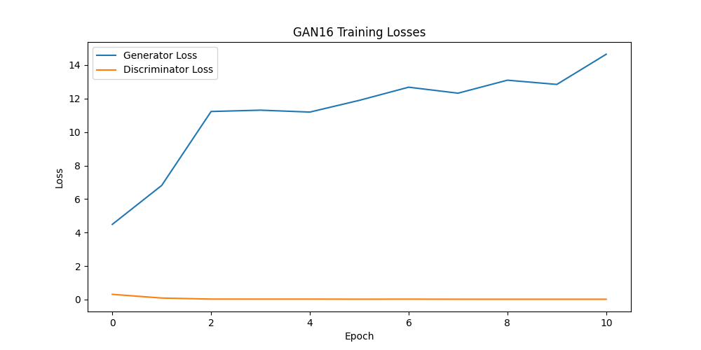

# Generative Modeling for Protein Structures

Implementation of "Generative Modeling for Protein Structures" (NeurIPS 2018), the first research paper on generative AI for protein design. 

Replicating the following steps:
1. Download PDB train and test data
2. Generate pairwise distance datasets of protein fragments
3. Train a GAN on the dataset
4. Recover structure predictions via convex optimization
5. Evaluate the quality of the predictions

##

...


Q: will any convex optimization algorithm do the trick?

--- 

revisiting this project

- [x] moving data ipynb stuff to python scripts
  - [x] download_pdbs.py
  - [x] get_pairwise_matrices.py


steps so far:
1. download the PDBs from `train_ids.txt` and `test_ids.txt`
2. get pairwise distance matrices for each PDB (16-residue fragments)
3. trained a GAN16 model, troubleshooted loss during training

- [ ] setup tracking with wandb or neptune


Symmetry enforcement for the distance matrices:

1. `torch.clamp(x, min=0)`:
   - Ensures all distances are non-negative (can't have negative distances)
   - Any negative values are set to 0

2. `0.5 * (x + x.transpose(2, 3))`:
   - `x.transpose(2, 3)` flips the last two dimensions of the tensor [batch, channel, height, width]
   - Adding the original and flipped versions and multiplying by 0.5 creates perfect symmetry
   - Example:
     ```python
     # Original matrix x
     [
       [0, 2, 3],
       [4, 0, 6],
       [7, 8, 0]
     ]

     # Flipped matrix x.flip(3)
     [
       [0, 4, 7],
       [2, 0, 8],
       [3, 6, 0]
     ]

     # After 0.5 * (x + x.flip(3))
     [
       [0, 3, 5],
       [3, 0, 7],
       [5, 7, 0]
     ]
     ```

This ensures that the distance from atom A to atom B is always equal to the distance from atom B to atom A, which must be true for any valid distance matrix.

---



This loss pattern shows classic signs of GAN failure - the generator loss is increasing while the discriminator loss is decreasing. This is a sign that the discriminator is getting better at distinguishing between real and fake data, while the generator is not learning effectively.

--- 

[Google NotebookLM](https://notebooklm.google.com/notebook/95771779-e958-4948-9733-7186bd6627a5)